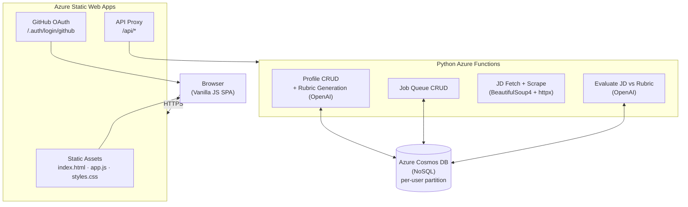
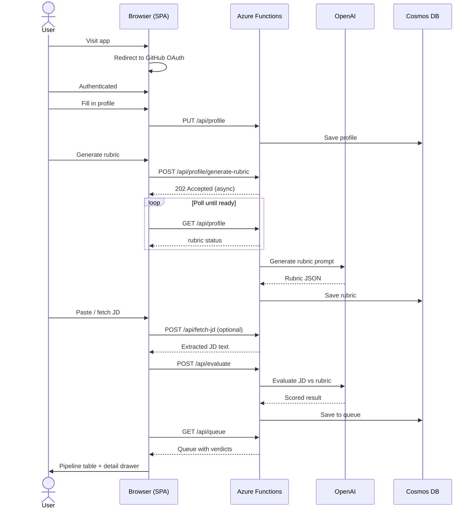

# job-role-evaluator

> AI-powered job description evaluator that scores roles against your personal priorities


<!-- demo gif -->

---

## Features

- **Personalized rubric** — generate a custom scoring rubric from your profile: target role, location, skills, compensation expectations, career goals, and preferred work arrangement
- **Paste or fetch JDs** — submit job descriptions directly or scrape them from a URL (LinkedIn-aware)
- **AI scoring** — per-section breakdown with knock-out detection; each dimension is scored and reasoned over by GPT
- **Pipeline queue** — sort and filter evaluations by verdict badge: Strong Pass → Strong Fail
- **Dark/light theme** — responsive layout with iPhone safe-area support
- **Per-user isolation** — GitHub OAuth via Azure Static Web Apps; every user's data is partitioned in Cosmos DB

---

## Architecture



---

## Tech Stack

| Layer      | Technology                                     |
|------------|------------------------------------------------|
| Frontend   | Vanilla HTML/CSS/JS (no build step)            |
| Backend    | Python 3.9, Azure Functions (serverless)       |
| AI         | Azure OpenAI (GPT-5-mini)                      |
| Database   | Azure Cosmos DB (NoSQL)                        |
| Auth       | GitHub OAuth via Azure Static Web Apps         |
| Hosting    | Azure Static Web Apps                          |
| CI/CD      | GitHub Actions                                 |

---

## Data Flow



---

## Project Structure

```
job-role-evaluator/
├── index.html                   # Single-page app shell
├── app.js                       # All frontend logic (SPA, 1 000+ lines)
├── styles.css                   # Design tokens, dark/light themes, responsive layout
├── serve.py                     # Local Flask dev server (proxies /api/* to Functions)
├── staticwebapp.config.json     # SWA routing, auth rules, cache headers
├── content.json                 # Static copy/label content
│
└── api/                         # Azure Functions backend
    ├── function_app.py          # All route handlers (11 endpoints)
    ├── requirements.txt         # Python dependencies
    ├── host.json                # Functions runtime config
    ├── local.settings.json      # Local env vars (never commit secrets)
    ├── shared/
    │   ├── auth.py              # Extract user ID from SWA principal header
    │   └── db.py                # Cosmos DB client helper
    └── prompts/
        ├── evaluate.yaml        # System + user prompts for JD evaluation
        └── generate_rubric.yaml # System + user prompts for rubric generation
```

---

## Local Development

### Prerequisites

- Python 3.9+
- [Azure Functions Core Tools v4](https://learn.microsoft.com/en-us/azure/azure-functions/functions-run-local)
- An Azure Cosmos DB account (or the [emulator](https://learn.microsoft.com/en-us/azure/cosmos-db/local-emulator))
- An Azure OpenAI resource with a `gpt-5-mini` deployment (or compatible)

### Steps

1. **Clone the repo**

   ```bash
   git clone https://github.com/<your-org>/job-role-evaluator.git
   cd job-role-evaluator
   ```

2. **Install Python dependencies**

   ```bash
   pip install -r api/requirements.txt
   ```

3. **Configure environment variables**

   Copy `api/local.settings.json` and fill in your credentials:

   ```json
   {
     "IsEncrypted": false,
     "Values": {
       "FUNCTIONS_WORKER_RUNTIME": "python",
       "AzureWebJobsStorage": "",
       "COSMOS_CONNECTION_STRING": "<your-cosmos-connection-string>",
       "OPENAI_ENDPOINT": "<your-azure-openai-endpoint>",
       "OPENAI_API_KEY": "<your-api-key>",
       "OPENAI_DEPLOYMENT": "gpt-5-mini"
     }
   }
   ```

   > **Never commit `local.settings.json`** — it contains secrets.

4. **Start the Azure Functions backend** (in a separate terminal)

   ```bash
   cd api
   func start
   ```

5. **Start the frontend dev server**

   ```bash
   python serve.py
   ```

6. **Open** `http://localhost:8080`

   The Flask dev server serves static files and proxies `/api/*` to the locally running Functions host at `http://localhost:7071`.

---

## API Reference

| Method   | Path                          | Description                                              |
|----------|-------------------------------|----------------------------------------------------------|
| `GET`    | `/api/queue`                  | Fetch user's evaluation queue (up to 500, sorted by date)|
| `POST`   | `/api/queue`                  | Create a new evaluation entry                            |
| `PATCH`  | `/api/queue/{id}`             | Partially update an evaluation entry                     |
| `DELETE` | `/api/queue/{id}`             | Delete a single evaluation entry                         |
| `DELETE` | `/api/queue`                  | Delete all evaluations for the current user              |
| `GET`    | `/api/profile`                | Get user profile and rubric                              |
| `PUT`    | `/api/profile`                | Save or update user profile                              |
| `PUT`    | `/api/profile/rubric`         | Save a manually edited rubric                            |
| `POST`   | `/api/profile/generate-rubric`| Kick off async rubric generation (returns 202)           |
| `POST`   | `/api/fetch-jd`               | Scrape a job description from a URL                      |
| `POST`   | `/api/evaluate`               | Evaluate a JD against the user's rubric                  |

All endpoints read the authenticated user identity from the `x-ms-client-principal` header injected by Azure Static Web Apps. In local development the user ID defaults to `local-dev-user`.

---

## Contributing

1. Fork the repository
2. Create a feature branch: `git checkout -b feat/your-feature`
3. Commit your changes: `git commit -m "feat: describe your change"`
4. Push and open a Pull Request against `main`

Please keep PRs focused — one feature or fix per PR. Include a short description of _why_ the change is needed.

---

_Made with ❤️ from London_
